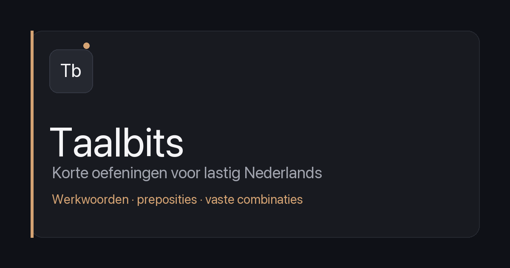

# 🇳🇱 Werkwoorden Quiz

A mobile-friendly multiple-choice quiz app for Dutch learners, focusing on **samengestelde werkwoorden** (compound/separable verbs) at B1+ level.

**[→ Try the live quiz](https://chardrizard.github.io/samengestelde-werkwoorden-quiz/)**



---

## What is this?

Dutch compound verbs are notoriously tricky — *opnemen*, *aannemen*, *afnemen*, and *innemen* all use "nemen" but mean completely different things. This quiz helps you practice distinguishing between them through contextual sentences.

**160 questions** across 4 verb themes:

| Theme | Verbs covered | Questions |
|-------|--------------|-----------|
| 🚪 **-komen** | aankomen · opkomen · bijkomen · uitkomen · voorkomen · meekomen · achterkomen · langskomen | 40 |
| 📌 **-zetten** | aanzetten · opzetten · afzetten · doorzetten · neerzetten · inzetten · voortzetten · uitzetten | 40 |
| 🤲 **-nemen** | opnemen · aannemen · afnemen · innemen · meenemen · toenemen | 40 |
| 🎯 **-halen** | ophalen · afhalen · inhalen · achterhalen · binnenhalen · uithalen | 40 |

## Features

- **Mobile-first dark UI** — designed for phone-in-hand study sessions
- **Instant feedback** — correct/wrong explanations for every answer, including why the wrong options are wrong
- **Hints** — optional hints if you're stuck
- **Shuffled questions** — different order every attempt
- **Review wrong answers** — see all mistakes at the end with explanations
- **Separated data & UI** — questions live in `questions.json`, independently editable
- **Zero dependencies** — single HTML file + JSON, no build step, no backend
- **Works offline** — once loaded, no internet needed

## Target level

**B1+ / B2** — suitable for learners who already know basic Dutch grammar and are working on expanding vocabulary and understanding idiomatic usage of separable verbs.

## Project structure

```
werkwoorden-quiz/
├── index.html          ← UI (HTML + CSS + JS, fetches questions.json)
├── questions.json      ← All 160 questions (editable independently)
├── og-image.png        ← Social sharing preview image
├── README.md
├── LICENSE
└── .gitignore
```

**Why separate files?** The HTML handles presentation and quiz logic. The JSON holds all question data. This means you can add/edit/fix questions without touching the UI code, and the browser caches each file independently.

## Adding or editing questions

Open `questions.json` and find the theme you want to edit. Each question looks like this:

```json
{
  "sentence": "De patiënt is gisteren in het ziekenhuis ______.",
  "options": ["opgenomen", "aangenomen", "ingenomen", "afgenomen"],
  "correct": 0,
  "explanation": "'Opnemen' = in het ziekenhuis laten blijven.",
  "wrongExplanations": {
    "1": "'Aangenomen' = geaccepteerd (baan).",
    "2": "'Ingenomen' = medicijn slikken.",
    "3": "'Afgenomen' = verminderen."
  },
  "hint": "Denk aan wat er in een ziekenhuis gebeurt."
}
```

- `correct` is the 0-based index of the right answer in the `options` array
- `wrongExplanations` keys are the indices of wrong options
- Save the file, commit, and push — GitHub Pages updates automatically

## Tech stack

Intentionally minimal:

- Single HTML file with inline CSS and vanilla JS
- External `questions.json` for all quiz content
- No framework, no build tools, no npm
- Google Fonts (DM Sans + DM Mono)
- Hosted on GitHub Pages (free)

## Run locally

```bash
git clone https://github.com/chardrizard/werkwoorden-quiz.git
cd werkwoorden-quiz
# Need a local server because of fetch() — opening file:// won't work
python3 -m http.server 8000
# Then visit http://localhost:8000
```

## Roadmap

- [ ] Add more verb themes (-geven, -staan, -slaan, -vallen)
- [ ] localStorage progress tracking
- [ ] Spaced repetition for wrong answers
- [ ] "Quick 20" mode (random subset)
- [ ] PWA support for install-to-homescreen
- [ ] Custom domain

## Contributing

Found a question with a wrong explanation or an unnatural sentence? Edit `questions.json` and open a PR. Native speaker corrections are especially welcome.

## License

MIT — use it, fork it, adapt it for other languages.

---

Built as a study tool for the Dutch diaspora community 🧡
